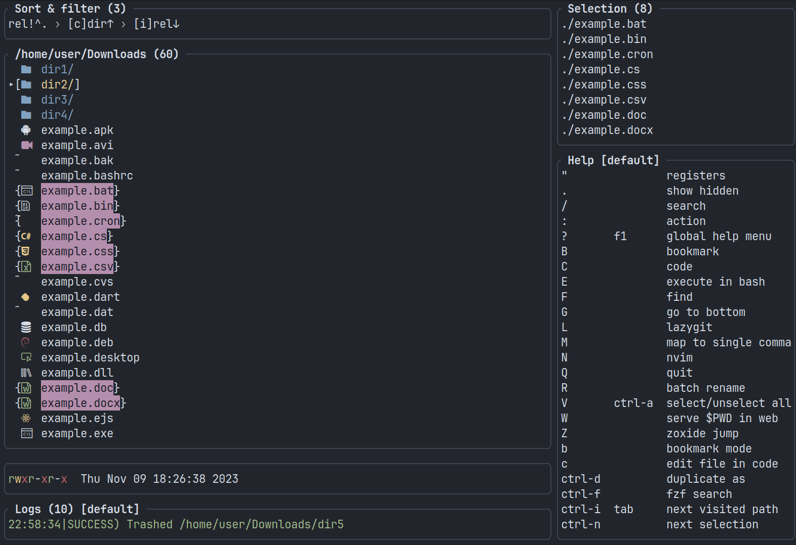

# dysh-style.xplr

This plugin complements the [xplr](https://github.com/sayanarijit/xplr) file manager theme.

It adds the following things:
- icons
- highlighting of selected files, folders, cursor

## Requirements

- [Nerd Font](https://www.nerdfonts.com/)

## Install

Use [xplr plugin manager](https://github.com/dtomvan/xpm.xplr/).

## In addition

To make the interface cleaner and more pleasant, I can also recommend the following plugins:
- [get-rid-of-index.xplr](https://github.com/dy-sh/get-rid-of-index.xplr)
- [one-table-column.xplr](https://github.com/duganchen/one-table-column.xplr)
